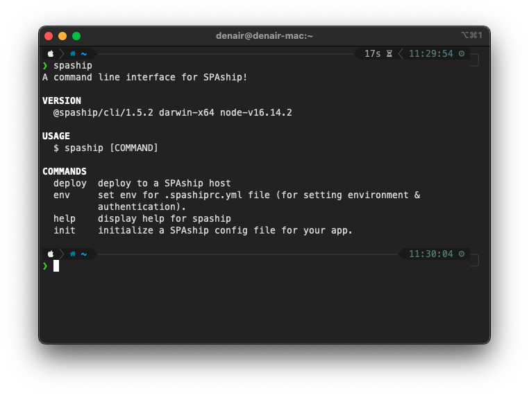
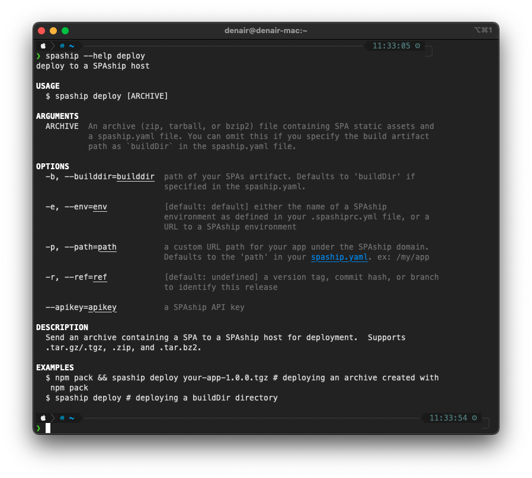
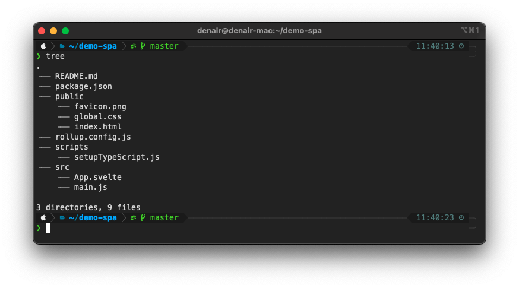
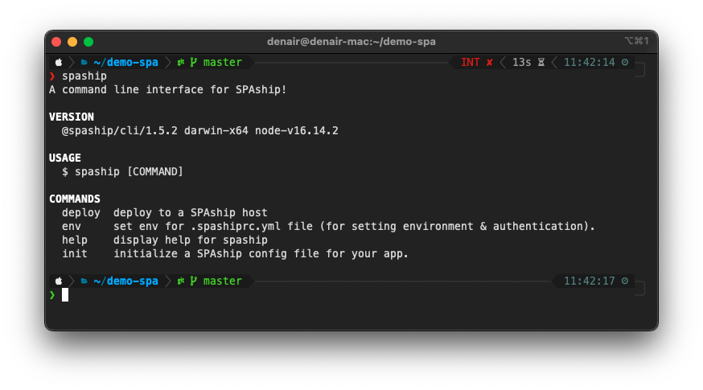
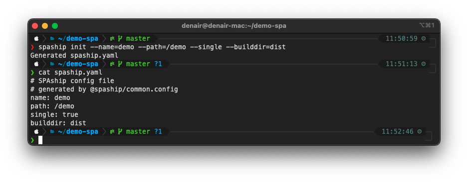
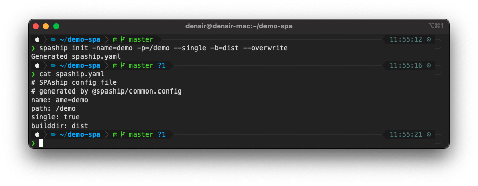
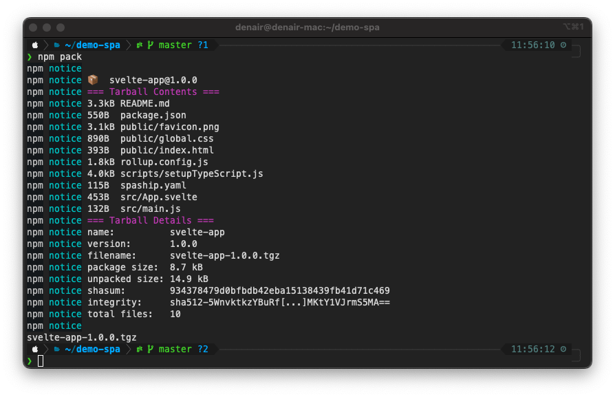
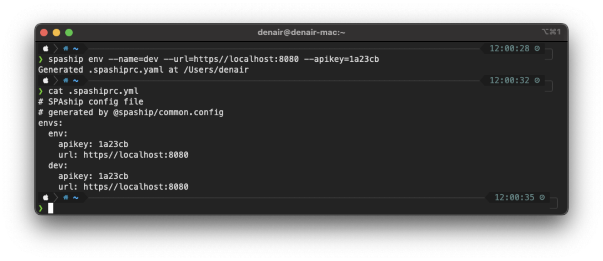

One of the most handy tools of the SPAship toolchain is the [**SPAship CLI**](https://www.npmjs.com/package/@spaship/cli). 

SPAship is build from scratch with an idea that developers anywhere can deploy and manage SPAs in their environment. It being open source any organization can benefit of it. It provides you with some of the most simple, yet developer friendly means to initialize and deploy your SPAs to your portal. 

## Prerequisites of SPAship CLI:

You would need [NodeJS](https://nodejs.org/en/download/) and NPM installed on your local system.
- [Node.js](https://nodejs.org/en/download/) version >= 14.x and above (which can be checked by running node -v).
- NPM >= 6 or above

## Installation of SPAship cli :
To install the SPAship Command Line Interface on your local system run :

```sh
npm install -g @spaship/cli@latest
```

:::note
The  -g  flag installs the CLI globally (accessible from any directory via the command line). To install it under a local directory, simply remove the  -g  flag.
:::

Once you have the SPAship CLI installed you would be one step closer to SPA Deployment. Let have a look at CLI commands to help you get started :
- To see an overview of the SPAship CLI run: 

```sh
spaship
```
# 

- To check which version of the SPAship CLI is currently running: **$ spaship (-v|--version|version)**
```
spaship --version
```
# 

- To see detailed information about any command: **$ spaship --help [COMMAND]**

```sh
spaship help
```
# 
# 
```
USAGE
  $ spaship help [COMMAND]

ARGUMENTS
  COMMAND  command to show help for

OPTIONS
  --all  see all commands in CLI
```


## SPA initialization

### Getting Started :-

We would be using a generic SPA repository for this example with the following directory structure.

# 


If we want to deploy the above SPA at a particular path (/demo) within an existing portal.We have to init the spaship.

### SPAship init :-

The first step to getting started with SPAship is the **spaship init** command. Executing it without any arguments invokes an interactive prompt which will ask you a few questions and generate a spaship.yaml config file. This command must be executed within the SPA folder using cli . The answers to these questions can also be passed in as CLI arguments while executing the command. Here’s a screenshot of the command’s help description:

# 

There are 3 ways to use the SPAship CLI to initialize a new SPA with the **spaship init** command, these are:

- Using the interactive mode:
# 
- Using long parameters: 
# 
- Using short parameters:
# 

```
USAGE
  $ spaship init

OPTIONS
  -n, --name=name    (required) a human-friendly title for your app
  -p, --path=path    (required) the URL path for your app under the SPAship domain. ex: /my/app
  -s, --[no-]single  route all non-asset requests to index.html
  --overwrite        overwrite existing spaship.yaml
DESCRIPTION
  Without arguments, init will ask you a few questions and generate a spaship.yaml config file.  The answers can also be
  passed in as CLI options.
```


**Note** -  The --overwrite flag used in the last two examples is used only when your project already has an existing spaship.yaml file, which we want to overwrite.
Run ***cat spaship.yaml*** command to view the content . spaship.yaml file contains the info which developer entered about the SPA in spaship init command.

## Packaging SPA:
Before using the deploy command the first thing that you need is a package containing your SPA. We can use **npm pack** command.
npm pack is built into npm , all it does is it packages the spa and makes it ready for deployment.

# 

This command will return an archive file with extension  .tar.gz/.tgz 

## SPAship deploy 
The spaship deploy command allows you to deploy your application to a SPAship host. It works by sending an archive containing a SPA to a SPAship host for deployment. At the moment, the CLI supports .tar.gz/.tgz, .zip, and .tar.bz2 archives.

The next step after packaging would be to execute the spaship deploy command to actually deploy your application to a SPAship host. However, prior to running this command, it's highly recommended that you have your **spashiprc configured**. Please refer to the below [Setting up .spashiprc.yml](##Setting-up-spashiprc.yml). Another important requirement for this step is the API Key required for the deployment. You can create a new API Key by using the SPA Manager’s Authentication section.
Once you have your spashiprc file configured, deploying your application is as easy as running : 

**$ spaship deploy demo-spa-1.0.0.tgz** 

```sh
spaship deploy demo-spa-1.0.0.tgz
```

Internally, this command translates to:

** curl `<hostname>`/api/v1/applications/deploy -H 'X-API-Key: `<API-Key>`' -F name=Demo SPA -F path=demo -F upload=@demo-spa-1.0.0.tgz -F ref=v1.0**

```
USAGE
  $ spaship deploy [ARCHIVE]

ARGUMENTS
  ARCHIVE  An archive (zip, tarball, or bzip2) file containing SPA static assets and a spaship.yaml file. You can omit
           this if you specify the build artifact path as `buildDir` in the spaship.yaml file.

OPTIONS
  -b, --builddir=builddir  path of your SPAs artifact. Defaults to 'buildDir' if specified in the spaship.yaml.
  -e, --env=env    [default: default] either the name of a SPAship environment as defined in your .spashiprc.yml file,
                   or a URL to a SPAship environment

  -p, --path=path  a custom URL path for your app under the SPAship domain. Defaults to the 'path' in your spaship.yaml.
                   ex: /my/app

  -r, --ref=ref    [default: undefined] a version tag, commit hash, or branch to identify this release

  --apikey=apikey  a SPAship API key

DESCRIPTION
  Send an archive containing a SPA to a SPAship host for deployment.  Supports .tar.gz/.tgz, .zip, and .tar.bz2.

EXAMPLES
  $ npm pack && spaship deploy your-app-1.0.0.tgz # deploying an archive created with npm pack
  $ spaship deploy # deploying a buildDir directory
  $ spaship deploy --env=dev
```

## Setting up spashiprc.yml
spashiprc is a yaml dot file in your **$HOME** directory that is used by SPAship to provide an alternative to typing out **--apikey `<KEY>`** and **--env `<URL>`** arguments every time you run spaship commands. You can use a spashiprc file to define an environment name (like **qa,dev,prod**) along with its URL and API key, after which you can run ***spaship deploy --env qa***. The URL and API key will be read from your spashiprc file.

:::info

spashiprc files are optional, but very convenient if you plan to do deployments from your dev environment. If your deployments are done by a CI/CD server, you probably don't need a spashiprc file and will be better off using ***--env URL*** and ***--apikey KEY***.

:::
:::note
**Important:** As a rule of thumb, spaship.yaml files are consumed by the SPAship API, whereas spashiprc files are consumed by the CLI.
:::

# 
```
USAGE
  $ spaship env --name=[name] --url=[url] --apikey=[apikey]

OPTIONS
  --name=name    (required) name of the alias
  --url=url    (required) deployment url of the property
  --apikey=apikey    (required) a SPAship API key 

DESCRIPTION
  This spaship env will create an alias in the spashiprc file, which we can use for the further deployment
```

### **spashiprc file demo:**
- #### <u>spashiprc with default environment</u>:
    
    This spashiprc file defines a default environment which will be used whenever **--env** is not provided.
    
    **.spashiprc.yml**

    ```yml
    envs:
    default:
        url: https://localhost:8008
        apikey: 57d5c061-9a02-40fc-a3e4-1eb3c9ae6a12
    ```

    **.spashiprc.yml**

    ```yml
    envs:
    default:
        url: https://localhost:8008
        apikey: 57d5c061-9a02-40fc-a3e4-1eb3c9ae6a12
    qa:
        url: https://qa.mysite.com:8008
        apikey: 57d5c061-9a02-40fc-a3e4-1eb3c8ae2a45
    ```
    Now when you run **spaship** commands, the **--env** flag is optional. When it's omitted, the default environment will be used.

    ```sh
    spaship deploy MyProject-1.0.0.tgz
    ```
- #### <u>spashiprc layering example</u>:
    **\$HOME/.spashiprc.yml**

    ```yml
    envs:
    qa:
        apikey: 57d5c061-9a02-40fc-a3e4-1eb3c9ae6a12
    prod:
        apikey: 70f19422-bf53-44b1-b664-f9b4636bea61
    ```

    **\$HOME/projects/MyProject/.spashiprc.yml**

    ```yml
    envs:
    qa:
        url: https://qa.spaship.io
    prod:
        url: https://spaship.io
    ```

    When you run spaship commands from within \$HOME/projects/MyProject, _both_ of the above _spashiprc_ files will be loaded and merged together, forming a complete definition of URL+API key for each environment.
    
    Such as:

    ```sh
    cd $HOME/projects/MyProject
    spaship deploy --env prod MyProject-1.0.0.tgz
    ```

    #### Or you could also use the following complete cli
    ```sh
    cd demo-spa
    npm install
    npm run build
    npx @spaship/cli@latest deploy --apikey=70f19422-bf53-44b1-b664-f9b4636bea61 --env=https://deploy-url-from-spaship-manager.com --builddir=dist --ref=1.0.0
    ```
:::info
The same set of commands can also be used in most CD setups.
:::
